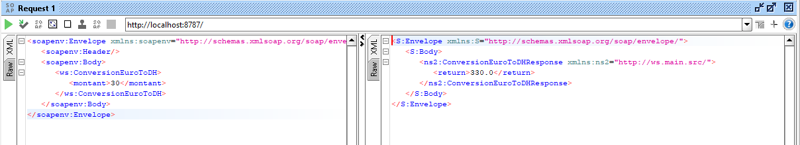

<h1>WEB SERVICE SOAP using JAVA</h1>

<h3>Server Steps :</h3>

<h4>SERVER RUNNING SUCCESSFULLY</h4>

<h4>Web Services ENDPOINT  & INFORMATION'S</h4>

<h4>WSDL :Document XML</h4>

<h3>Client Steps :</h3>

<h4>SoapUI Implementation</h4>

<h4>Request 1 => ConversionEuroToDH operation</h4>

<h4>Request 2 => GetAll operation</h4>

<h4>Request 3 => GetCompte operation</h4>

<h4>Generate Code from WSDL</h4>

<h4>WEB SERVICE APPLICATION</h4>

